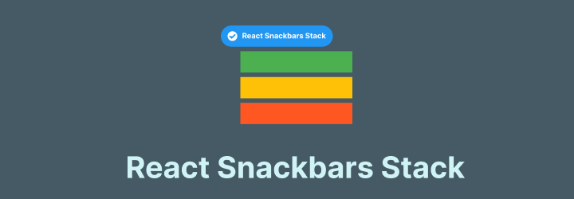

# React Snackbars Stack
<p align="center">
  
  <br/>
  
  
  

  <p align="center">React Snackbars Stack to show multiple snackbars as queue/stack</p>
</p>

## Description

React Snackbars Stack is a flexible and easy-to-use library for displaying snackbars in your React applications. It provides a simple API to show notifications with different severities and customizable options. Whether you need to show a single snackbar or manage a stack of multiple snackbars, this library has you covered.

## Installation

Install the package using npm or yarn:

```bash
npm install react-snackbars-stack
# or
yarn add react-snackbars-stack
```

## Usage

### Option 1: Direct Use

Import the `SnackbarProvider` and wrap your application with it. Use the `enqueueSnackbar` method to show snackbars.

> **🚀 Important Note:** You don't need to wrap your entire application with the `SnackbarProvider` context. You can use it directly in any component by placing it inside the render method, such as the return statement in a function component or the render method in a class component.

```jsx
import React from 'react';
import { SnackbarProvider, enqueueSnackbar } from 'react-snackbars-stack';

function App() {
  const handleClick = () => {
    enqueueSnackbar('This is a snackbar message!');
    // OR
    enqueueSnackbar(
      'This is a snackbar message with applied options!', 
      {
        severity:'success', // inof, success, warning, error
        preventDuplicate:true,
        duration:1500
      }
    );
  };

  return (
    <>
      <SnackbarProvider /> {/* Check API for options */}
      <button onClick={handleClick}>Show Snackbar</button>
    </>
  );
}

export default App;
```

### Option 2: Using Hook

Wrap your root app or a specific parent app with the `SnackbarProvider` context. Import the hook in a child component to use the method to show snackbars.

```jsx
import React from 'react';
import { SnackbarProvider, useSnackbar } from 'react-snackbars-stack';

function MyComponent() {
  const { enqueueSnackbar } = useSnackbar();

  const handleClick = () => {
    enqueueSnackbar(...);
  };

  return (
    <>
      <button onClick={handleClick}>Show Snackbar</button>
    </>
  );
}

const App = () => (
  <SnackbarProvider>
    <MyComponent />
  </SnackbarProvider>
);

export default App;
```

## NextJS support 
If you're using Next.js and need to integrate the react-snackbars-stack package into your root layout (or any server component), you’ll need to handle the use client directive. This is required because the context provider relies on React hooks, which are incompatible with server components by default. 

Create a Wrapper Component, e.g., SnackbarProviderWrapper.jsx, with the `use client` directive.
```jsx
'use client';

import { SnackbarProvider } from 'react-snackbars-stack';

export default SnackbarProvider;
```

## Screenshot


## API

### `enqueueSnackbar` Method

The `enqueueSnackbar` method is used to show a snackbar notification. If there are already some snackbars being displayed, it adds the snackbar above or below the existing snackbars in the stack.

| Option           | Type    | Description                          | Default |
|------------------|---------|--------------------------------------|---------|
| message          | string  | The message to display               | -       |
| severity         | string  | The severity of the message          | 'info'  |
| preventDuplicate | boolean | Prevent duplicate messages           | false   |
| duration         | number  | Duration to show the snackbar (ms)   | 3000    |

### `SnackbarProvider` Component

The `SnackbarProvider` component is used to wrap your application and provide the snackbar context.

| Option           | Type    | Description                          | Default |
|------------------|---------|--------------------------------------|---------|
| maxSnackbars     | number  | Maximum number of snackbars to show  | 3       |
| autoHideDuration | number  | Duration to auto-hide the snackbar   | 3000    |
| icon             | boolean | Hide the icon in the snackbar        | true    |
| theme            | string  | Theme of the snackbar ('dark' or 'light') | 'light' |
| anchorOrigin     | object  | Position of the snackbar                  | { vertical: 'bottom', horizontal: 'left' } |
| transitionType   | string  | Transition type for the snackbar ('slide', 'grow', 'fade', 'zoom') | 'slide' |

## TODO

- [x] Custom hook support
- [x] Theme switching (MUI based)
- [ ] Filled icons option
- [ ] Custom theming support
- [ ] Custom transitions

**Purpose:** Created for personal use due to Notistack's outdated dependencies causing deployment issues. Published for anyone seeking an alternative to Notistack (though this package is not superior to Notistack).

## Connect with Us

Feel free to reach out:
- [Twitter](https://x.com/heyKSR)
- [LinkedIn](https://www.linkedin.com/in/kishorjena)

## Contribution

Contributions are welcome! Please open an issue or submit a pull request on GitHub.

## License

This project is licensed under the MIT License. See the [LICENSE](LICENSE) file for details.

